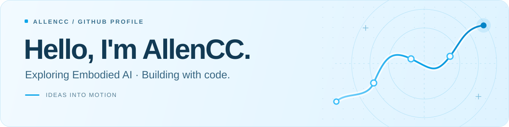
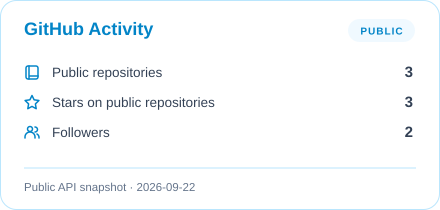
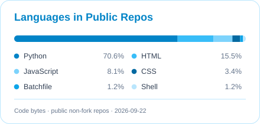
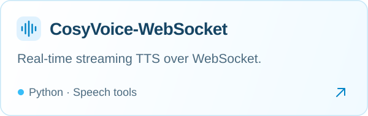
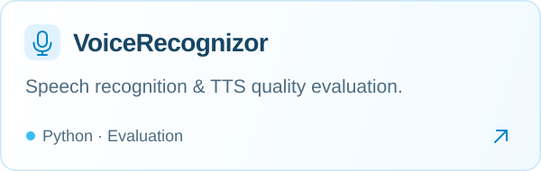

<picture>
  <source media="(prefers-color-scheme: dark)" srcset="./assets/header-dark.svg">
  <source media="(prefers-color-scheme: light)" srcset="./assets/header-light.svg">
  
</picture>

 

### About me

- 🤖 I'm exploring **embodied intelligence**.
- 🎙️ My current open-source work focuses on **speech tools and evaluation**.
- 🛠️ I enjoy turning ideas into useful, working tools.
- 🌱 More projects are on the way.

  <code>Python</code> &nbsp; <code>Speech tools</code> &nbsp; <code>Open source</code>

### GitHub activity

<picture>
  <source media="(prefers-color-scheme: dark)" srcset="./profile/stats-dark.svg">
  <source media="(prefers-color-scheme: light)" srcset="./profile/stats-light.svg">
  
</picture>
<picture>
  <source media="(prefers-color-scheme: dark)" srcset="./profile/languages-dark.svg">
  <source media="(prefers-color-scheme: light)" srcset="./profile/languages-light.svg">
  
</picture>

### Featured projects

<a href="https://github.com/Allencc5658/CosyVoice-WebSocket">
  <picture>
    <source media="(prefers-color-scheme: dark)" srcset="./assets/cosyvoice-dark.svg">
    <source media="(prefers-color-scheme: light)" srcset="./assets/cosyvoice-light.svg">
    
  </picture>
</a>
<a href="https://github.com/Allencc5658/VoiceRecognizor">
  <picture>
    <source media="(prefers-color-scheme: dark)" srcset="./assets/voice-recognizor-dark.svg">
    <source media="(prefers-color-scheme: light)" srcset="./assets/voice-recognizor-light.svg">
    
  </picture>
</a>

### A little progress, every day

<picture>
  <source media="(prefers-color-scheme: dark)" srcset="./profile/snake-dark.svg">
  <source media="(prefers-color-scheme: light)" srcset="./profile/snake-light.svg">
  
</picture>

 

Exploring embodied intelligence. Building one project at a time.

